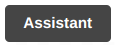
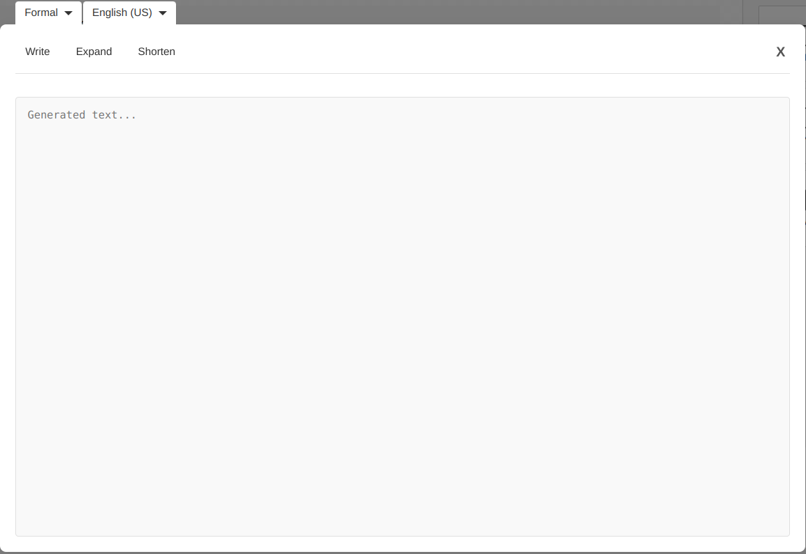
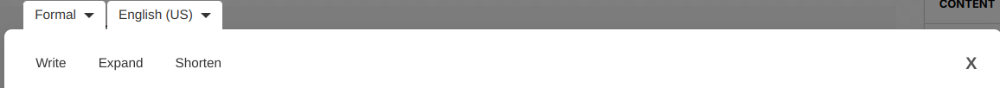
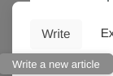
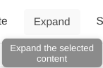
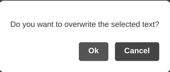
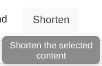
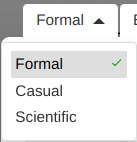
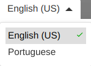
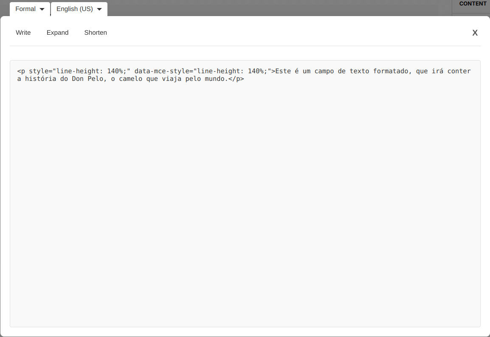

# How to use AI-Driven Editor!

AID Editor helps writing new articles or rewriting existent ones.

# Getting Started

## Add the Component to your Page

Add this line to the head of your HTML file

    <script type="module" src="./dist/aid-editor.min.js"></script>

Simply copy and paste the following code into the HTML of your webpage where you want the component to appear:

```
<aid-editor></aid-editor>
```

## Use the Component

Once added to your page, the AID Editor will provide a interface for content creation and modification.
To access the component in the webpage click the button **Assistant** to open the editor



The editor is composed by the toolbar and text area.



### Toolbar

The toolbar is composed by the functionality buttons and the writing style and language drop downs.



#### Write

The **Write** button allows the user to generate an article by inputting a theme in the input box.



When clicking the **Generate** button a article is written using the chosen writing style from the drop down as well as the language that is chosen at the moment.


#### Expand

The **Expand** button allows the user to expand selected content in the text area.



When clicking the button and there was selected text in the text area a modal will show asking for confirmation on overwriting the text.



#### Shorten

The **Shorten** button allows the user to shorten selected content in the text area.



When clicking the button and there was selected text in the text area a modal will show asking for confirmation on overwriting the text.


#### Writing Style Dropdown

The **Writing Style** dropdown allows the user to change the style in which the writing should be done.



#### Language Dropdown

The **Language** dropdown allows the user to change the language in which the editor and the writing should be done.



### Text area

The text area displays the text that has been selected outside of the editor



This text can then be altered by using the funcionalities of the toolbar.
