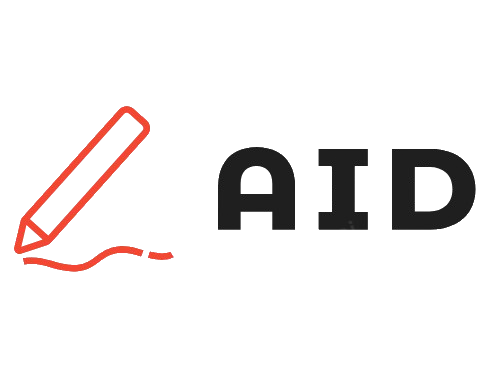

<a id="readme-top"></a>

[![Contributors][contributors-shield]][contributors-url] [![Forks][forks-shield]][forks-url] [![Stargazers][stars-shield]][stars-url] [![Issues][issues-shield]][issues-url] [![MIT License][license-shield]][license-url] [![LinkedIn][linkedin-shield]][linkedin-url]
<br />

<div align="center"> 
  <a href="https://github.com/smilee02/aid-editor">  
  </a> 
  <h3 align="center">AID - AI-Driven Editor</h3> 
  <p align="center"> AID is a web component developed in Lit that helps make writing and editing easier using artificial intelligence. With AID, you can quickly generate new content and improve existing text.    
    <br /> 
    <a href="https://github.com/smilee02/aid-editor">
      <strong>Explore the docs »</strong>
    </a> 
    <br /> 
    <br /> 
    <a href="https://github.com/smilee02/aid-editor">View Demo</a>
    · 
    <a href="https://github.com/smilee02/aid-editor/issues/new?labels=bug&template=bug-report---.md">Report Bug</a>
    · 
    <a href="https://github.com/smilee02/aid-editor/issues/new?labels=enhancement&template=feature-request---.md">Request Feature</a>
  </p> 
</div>

<details>
  <summary>Table of Contents</summary>
  <ol>
    <li>
      <a href="#about-the-project">About The Project</a>
      <ul>
        <li><a href="#features">Features</a></li>
        <li><a href="#built-with">Built With</a></li>
      </ul>
    </li>
    <li>
      <a href="#getting-started">Getting Started</a>
      <ul>
        <li><a href="#requirements">Requirements</a></li>
        <li><a href="#installation">Installation</a></li>
        <li><a href="#setting-openai-environment-variable">Setting OpenAI Environment Variable</a></li>
      </ul>
    </li>
    <li><a href="#usage">Usage</a></li>
    <li><a href="#running-tests">Running Tests</a></li>
    <li><a href="#roadmap">Roadmap</a></li>
    <li><a href="#contributing">Contributing</a></li>
    <li><a href="#contact">Contact</a></li>
    <li><a href="#acknowledgments">Acknowledgments</a></li>
  </ol>
</details>

## About The Project

[![AID-Editor][product-screenshot]](images/Editor.png)

AID is a web component developed in Lit that helps make writing and editing easier using artificial intelligence. With AID, you can quickly generate new content and improve existing text.

## Features

- Real-time AI content generation and rewriting
- Cross-platform compatibility
- Write Articles, Expand Content, Shorten Content
- Highly Customizable
- Available in Different Languages

<p align="right">(<a href="#readme-top">back to top</a>)</p>

## Editor Compatibility

AID-Editor is designed to work seamlessly with popular text editors. Here is a list of currently supported editors:

- **Unlayer Editor**: Compatible (Not compatible with HTML)
- **Froala Editor**: Compatible
- **CKEditor5**: Compatible

Support for more editors is on the roadmap. If you have a specific editor in mind that you would like to see supported, please open an issue or contribute to the project.

<p align="right">(<a href="#readme-top">back to top</a>)</p>

## Built With

- [![Lit][Lit.dev]][Lit-url]
- 
- 

<p align="right">(<a href="#readme-top">back to top</a>)</p>

## Getting Started

### Requirements

- **OpenAI API Key**: The AI features of AID require an OpenAI API key for ChatGPT. Please make sure you have a valid API key to use the AI functionalities.

### Installation

Clone the repo

```bash
git clone https://github.com/smilee02/aid-editor.git
```

Go to the project directory

```bash
cd aid-editor
```

Install dependencies

```bash
npm install
```

Build the project

```bash
npm run build
```

Add to your HTML file

```html
<script type="module" src="./dist/aid-editor.min.js"></script>
```

And to use the component

```html
<aid-editor></aid-editor>
```

## Setting OpenAI Environment Variable

To use the AID (AI-Driven Editor) web component, you'll need to set the `OPENAI_API_KEY` environment variable. This key is required for the AI-driven functionalities. Below are the instructions for setting this variable on Linux, Windows, and macOS.

### Linux / macOS

1. **Open Terminal:**

2. **Set the Environment Variable:**

   ```bash
   export OPENAI_API_KEY=your-api-key-here
   ```

3. **Persist the Variable Across Sessions:**

- To make the variable available in every terminal session, add the export command to your shell configuration file:

  - For bash, add it to ~/.bashrc or ~/.bash_profile:

    ```bash
    echo 'export OPENAI_API_KEY=your-api-key-here' >> ~/.bashrc
    source ~/.bashrc
    ```

  - For zsh, add it to ~/.zshrc:

    ```bash
    echo 'export OPENAI_API_KEY=your-api-key-here' >> ~/.zshrc
    source ~/.zshrc
    ```

4. **Verify the Variable:**

   Check that the environment variable is set by running:

   ```bash
   echo $OPENAI_API_KEY
   ```

### Windows

1.  **Open Command Prompt or PowerShell:**

2.  **Set the Environment Variable Temporarily:**

    - For Command Prompt:

      ```cmd
      set OPENAI_API_KEY=your-api-key-here
      ```

    - For PowerShell:

      ```powershell
      $env:OPENAI_API_KEY="your-api-key-here"
      ```

3.  **Persist the Variable Across Sessions:**

    - To make the environment variable permanent, use the following commands:

      - For Command Prompt:

        ```cmd
        setx OPENAI_API_KEY "your-api-key-here"
        ```

      - For Powershell:

        ```powershell
        [System.Environment]::SetEnvironmentVariable("OPENAI_API_KEY", "your-api-key-here", "User")
        ```

      After setting this, you may need to restart your Command Prompt or PowerShell session for the changes to take effect.

    <br>

4.  **Verify the Variable:**
    Check that the environment variable is set by running:

    - Command Prompt

      ```cmd
      echo %OPENAI_API_KEY%
      ```

    - PowerShell:

      ```powershell
      echo $env:OPENAI_API_KEY
      ```

<p align="right">(<a href="#readme-top">back to top</a>)</p>

## Running Tests

To run tests, run the following command

```bash
npm run test
```

## Usage

To use the AID component, you can add the following HTML tag to your web page:

```html
<aid-editor></aid-editor>
```

After adding the component, you'll be able to use its features for AI-driven writing and editing.

<p align="right">(<a href="#readme-top">back to top</a>)</p>

## Custom Events on Editor Initialization

To integrate the web component with the editor, when it is initialized or created, you need to dispatch a `CustomEvent` with the `editor-initialized` event name.

### CKEditor 5

For CKEditor 5, you can listen for the editor's initialization event by using the `ClassicEditor.create` method and dispatching a custom event when the editor instance is ready.

```js
import { ClassicEditor } from "ckeditor5";

ClassicEditor.create(document.querySelector(".selector"), editorConfig)
  .then((editor) => {
    document.dispatchEvent(
      new CustomEvent("editor-initialized", { detail: editor })
    );
  })
  .catch((error) => {
    console.error(error);
  });
```

In this example, after CKEditor 5 is successfully created, a `CustomEvent` named `editor-initialized` is dispatched with the editor instance attached as the event detail.

### Froala Editor

For Froala Editor, you can listen for the `initialized` event provided by the editor and dispatch a custom event when the editor instance is ready.

```js
var editor = new FroalaEditor("#editor-container", {
  events: {
    initialized: () => {
      document.dispatchEvent(
        new CustomEvent("editor-initialized", { detail: editor })
      );
    },
  },
});
```

In this example, once Froala Editor is initialized, a `CustomEvent` named `editor-initialized` is dispatched with the editor instance attached as the event detail.

The `CustomEvent` must be named `editor-initialized` and send in the `detail` the `editor`

<p align="right">(<a href="#readme-top">back to top</a>)</p>

## Known Bugs

Here are some of the currently known bugs in AID:

- **Bug 1**: **Unexpected `<p>` and `<br>` Tag Placement**  
  When opening or closing the assistant, additional `<p>` (paragraph) and `<br>` (line break) tags may be inserted unexpectedly. This behavior is dependent on the specific editor configuration and can result in unwanted formatting.

If you encounter any other bugs, please report them [here](https://github.com/smilee02/aid-editor/issues/new?labels=bug&template=bug-report---.md).

<p align="right">(<a href="#readme-top">back to top</a>)</p>

## Roadmap

- [x] Basic AI-driven text editing
- [x] Cross-platform compatibility
- [x] Unlayer Compatibility
- [x] Froala Compatibility
- [x] CKEditor5 Compatibility
- [ ] Test integration
- [ ] Support for more languages
- [ ] Support for more editors

See the open issues for a full list of proposed features (and known issues).

<p align="right">(<a href="#readme-top">back to top</a>)</p>

## Contributing

Contributions are what make the open-source community such an amazing place to learn, inspire, and create. Any contributions you make are greatly appreciated.

If you have a suggestion that would make this better, please fork the repo and create a pull request. You can also simply open an issue with the tag "enhancement". Don't forget to give the project a star! Thanks again!

1. Fork the Project
2. Create your Feature Branch (`git checkout -b feature/AmazingFeature`)
3. Commit your Changes (`git commit -m 'Add some AmazingFeature'`)
4. Push to the Branch (`git push origin feature/AmazingFeature`)
5. Open a Pull Request

<p align="right">(<a href="#readme-top">back to top</a>)</p>

### Top contributors:

<a href="https://github.com/smilee02/aid-editor/graphs/contributors">
  
</a>

## Contact

Project Link: [https://github.com/smilee02/aid-editor](https://github.com/smilee02/aid-editor)

<p align="right">(<a href="#readme-top">back to top</a>)</p>

## Acknowledgments

- [OpenAI](https://openai.com/)
- [Lit][Lit-url]
- [Othneildrew's Best-README-Template](https://github.com/othneildrew/Best-README-Template)

<p align="right">(<a href="#readme-top">back to top</a>)</p>

[contributors-shield]: https://img.shields.io/github/contributors/smilee02/aid-editor.svg?style=for-the-badge
[contributors-url]: https://github.com/smilee02/aid-editor/graphs/contributors
[forks-shield]: https://img.shields.io/github/forks/smilee02/aid-editor.svg?style=for-the-badge
[forks-url]: https://github.com/smilee02/aid-editor/network/members
[stars-shield]: https://img.shields.io/github/stars/smilee02/aid-editor.svg?style=for-the-badge
[stars-url]: https://github.com/smilee02/aid-editor/stargazers
[issues-shield]: https://img.shields.io/github/issues/smilee02/aid-editor.svg?style=for-the-badge
[issues-url]: https://github.com/smilee02/aid-editor/issues
[license-shield]: https://img.shields.io/github/license/smilee02/aid-editor.svg?style=for-the-badge
[license-url]: https://github.com/smilee02/aid-editor/blob/master/LICENSE.txt
[linkedin-shield]: https://img.shields.io/badge/-LinkedIn-black.svg?style=for-the-badge&logo=linkedin&colorB=555
[linkedin-url]: https://www.linkedin.com/in/francisco-cardoso02/
[product-screenshot]: images/Editor.png
[Lit.dev]: https://img.shields.io/badge/LIt-4d64ff?&style=for-the-badge&logo=data:image/png;base64,iVBORw0KGgoAAAANSUhEUgAAAMgAAADICAMAAACahl6sAAAAAXNSR0IB2cksfwAAAAlwSFlzAAALEwAACxMBAJqcGAAAAGZQTFRFAAAAMlD/Mk//Mk7/JzCWKDGYKDCXHJL/AOj/GZz/KDCYMk7/ME//H4j/LUDLAPX/FI3LAP//APL/APT/Af//LkLSFoHFMk/9LkTbKDCZAP//AOf/Mk3/JzKYAP//AOj/MFf/JnP/Nqz/dwAAACJ0Uk5TAHD/gHD/gP///////+P/z///////////3H+AgP+Pj4+WuxFwVn8AAAc6SURBVHic3dxbb+REEAVge5KwChkeEEJaQAv//1eBeEAgWAkhsVnChsF396Uup8ttJzXzEkWqsf1NP7rOaZv9P+3liJsccIv2v/1vcgDk5tJcBaRzXAWkd1wDZHBcAWR0+IdMDveQ2eEdsjicQ1aHb0jgcA0JHZ4hkcMxJHb4hSQOt5DU4RWSOZxCcodPCOFwCaEcHiGkwyGEdviDMA53EM7hDcI6nEF4hy+I4HAFkRyeIKLDEUR2+IEoDjcQzeEFojqcQHSHDwjgcAFBHB4gkMMBBHO8fgjoeP2QEzgHQm4/mZ/kVUFu23/tj/KKIJ9dmquAdI6rgPSOa4AMjiuAjA7/kMnhHjI7vEMWh3PI6vANCRyuIaHDMyRyOIbEDr+QxOEWkjq8QjKHU0ju8AkhHC4hlMMjhHQ4hNAOfxDG4Q7CObxBWIczCO/wBREcriCSwxNEdDiCyA4/EMXhBqI5vEBUhxOI7vABARwuIIjDAwRyOIBgjtcPuQXfx1eHoAF0EHKHLgyAEPLxSMjpgkkwyF37DM2hEDofT0Ma7N4Q5M2lqQph8vEMBJMgkM5RFcLl4zkIJAEgvaMmhM3HsxBEokMGR0UIn4/nIYBEhYyOehAhHy9AdIkGmRzVIFI+XoKoEgUyO2pBxHy8CNEkMmRxVILI+XgZokhEyOqoA1Hy8QpElkiQwFEFouXjNYgoESChowZEzcerEEnCQyJHBYiej9chgoSFxI7tECAfD0B4CQdJHJshSD4egbASBpI6tkKgfDwE4SQ0JHNshGD5eAzCSEhI7tgGAfPxIISWUBDCsQmC5uNRCCkh5igHC7lLnpyAwPl4GEJJ8jnSseFE8Hw8DiEk2RztsEMK8vEFkFySzjEOM6QkH18CySTJHOewQory8UWQVBLPsQ4jpCwfXwZJJNEc77BBCvPxhZBYEs4JDhOkNB9fCokkwZzksECK8/HFkFCyzokOA6Q8H18OCSTLnOwohxjy8QbIKpnnFEcxxJKPt0AWyTSnOUohpny8CTJLxjnVUQiJHfeP+Vw9yCQZ5nRHGcSYjzdCRkk/BziKINZ8vBUySE6YowRizsebIb3khDkKIPZ8vB3SXC6nO+ztNgxplet9/mH4UxnSXM7g+2QU8gl8618bcm7/wQZByMNf2FxtyPnx3H6AJjHIw8cnaK425PzYnJvT38goBHn42LwIpHN0EEyCQDrHi0B6Rw+BJACkd7wEZHAMEESiQwbHC0BGxwgBJCpkdBwPmRwTRJdokMlxOGR2zBBVokBmx9GQxbFANIkMWRwHQ1bHClEkImR1HAsJHAFElkiQwHEoJHSEEFEiQELHkZDIEUFuLryEh0SOAyGxI4JIZ8JCYsdxkMSRQHgJB0kch0FSRwphJQwkdRwFyRwZhJPQkMxxECR35BBGQkJyxzEQwkFAaAkFIRyHQCgHBSElBIRyHAEhHSSEkuQQ0nEAhHbQEEKSQWjH/hDGwUBySQphHLtDOAcHySQJhHPsDWEdLCSVxBDWsTOEd/CQRBJBeMe+EMEhQGJJCBEcu0IkhwSJJAFEcuwJER0iJJSsENGxI0R2yJBAskBkx34QxaFAVskMURy7QTSHBlkkE0Rz7AVRHSpklowQ1bETRHfokEkyQHTHPhDAAUBGSQ8BHLtAEAcCGSTPmGMPCOSAIL3kGXPsAPnqT+iCEKSTPH+Jva/lIV//Hv4HQ96+h+4LQprTDfjeufqJfPMHdkEQct+CPwwIIQMH9K4BWG2AQe5/ab7DJBiEjoAwSxOYBIJ0jgaUQBAmlMNtf0ASBDI4QAkC4WJS7BoLIgEgkwOTABA2uMbv4wASHbI4IIkO4aOEwmKRLlEhgQORqBAh3CltSKkSDRI5AIkGkeK24qqXJlEgiUOXiJD7RzEALe+sKRIZkjlUiXwiciRdWb6TJSKEcGgSEaKUBGhbhKJEgpAORSJBtNoGdR1SkggQxiFLBIhapKHvdQoSHsI6REkI+Ta6gl5tAiyo8hIWIjgkCXsiQNkMsmnLSjiI6BAkHASp/4FWhjkJA1EcvISBQIVM2O4zI6EhqoOV0BCsIgtc4qYlJARwcBISAtaMoR10pISCQA5GQkHQujS4TI+SEBDQQUsICFz7hrcCEpIcAjtISQ6BHSX1hrkkgxQ4KEkGwR1FPY2ZJIUUOQhJCilwlBVOppIEUujIJQmkxFHYnJlIYkixI5PEkCJHaQVoLIkgBkcqiSBljuIu00gSQkyORBJCCh3lpayTZKg0CSBGRywJIKUOQ7tscCYrxOyIJCuk2GGpyV0lC2SDI5QskHKHqe93kcyQTY5AMkMMDltx8SyZIBsdq2SCWBzGBuZJMkI2OxbJCDE5rFXSo2SAVHDMkgFic5g7sQdJD6nimCQ9xOiwl3v3knM1xyh5sjs2tJR3knM9xyB5sju21K2/+/X8xc/2r2efH357+v4n87e39Ma/a2s6OsnpR/uX/wfZxmb2vk13qAAAAABJRU5ErkJggg==
[Lit-url]: https://lit.dev/
